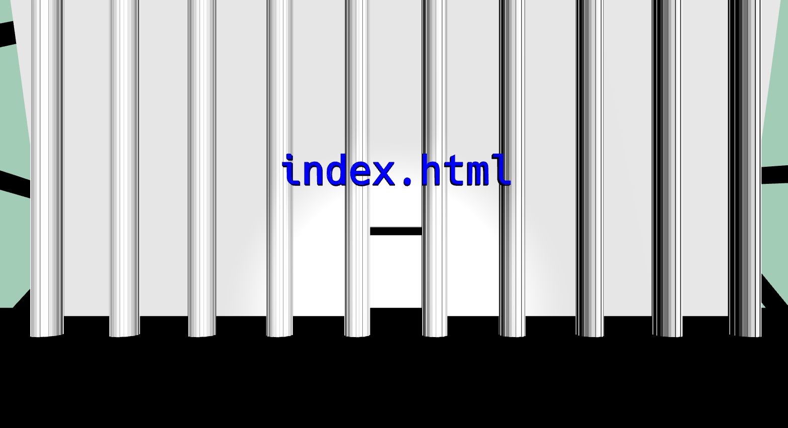
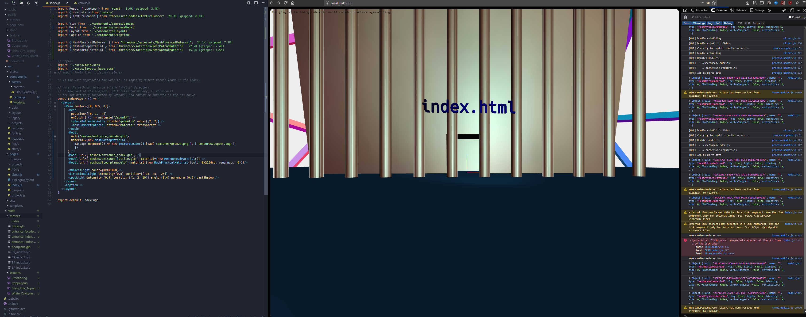
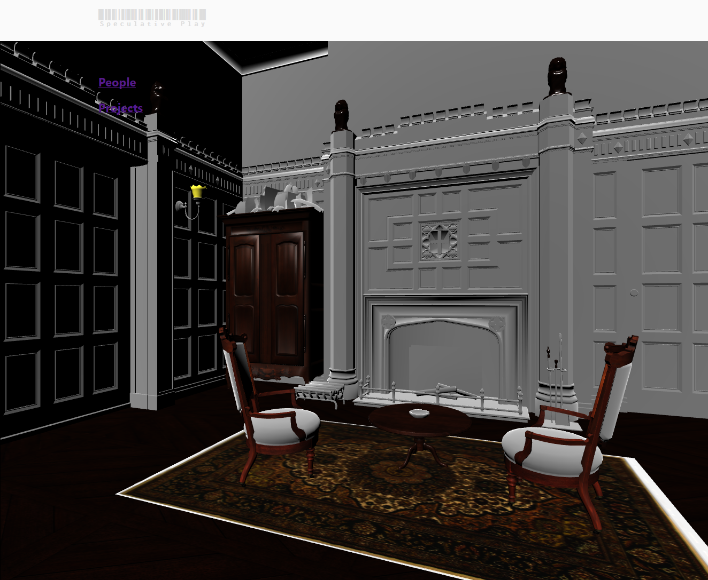

# Journal

### Alternative forms

#### 1. Low-Tech Magazine ([link](https://solar.lowtechmagazine.com))

I came across this website by accident - I was exploring the web for lighter website designs after I some concern with the size of my personal homepage. I came across this [7kb WordPress theme](https://sustywp.com/) with the nav on a separate page and no images. This blog talked about the real energy costs of a website, and this led me to the rabbit hole of energy efficient hosting whereupon I stumbled onto Low Tech mag.

This project _deeply_ fascinates me. There's the wonderful connection to the real world that I fear the web has completely lost. It's grown so large that the web as a universe need not refer to anything this side of the screen. And yet this website keeps you keenly aware of the sunshine a little solar panel is receiving over in Barcelona, and how many other people must be browsing at once as the battery trickles down.

Note how in the screenshot above, the site is mere minutes away from going offline. The site died midway though writing the following paragraph.

> To focus on energy efficiency is to make present ways of life non-negotiable.

I like how LTM has come to the same design choices (dithered, grayscale images; tiny page sizes with minimal CSS, no custom fonts & few extraneous assets) as sites from the early days of the internet - yet with the constraint of power consumption instead of end-user processing power and internet speed.

In the context of this project, a web run on machines dependant on the weather, or some other decidedly _non-techie_ thing, is a path I mean to explore.

#### 2. Dat Protocol ([link](https://datproject.org/))

This is again an exploration of an extant alternative form to the net - in this case sites hosted by many individuals freely giving bandwidth to keep other sites alive.

A project I'm familiar on the decetralized network is that of Devine Lu Linevega's [_Rotonde_](dat://2f21e3c122ef0f2555d3a99497710cd875c7b0383f998a2d37c02c042d598485/). It's a 'webring' of artists and like-minded people (to Devine) functioning akin to Twitter. A neat and somewhat successful experiment with the medium.

It's almost unbroken ground here. The platform is so far in it's infancy all one can find are little experiments and personal blogs, with maybe the odd whitepaper from some other crypto currency of the like.

In the same vein, I've come across the [Open Bazaar Project](https://openbazaar.org/); a browser, protocol and ecommerce site rolled into one. It uses bitcoin to buy and sell things anonymously. This would seem ideal for drug trading, but that's curiously absent from the very polished homepage demo.

#### 3. "Sneakernet" ([wikipedia](https://en.wikipedia.org/wiki/Sneakernet))
A close relative of _dead drops_ and the like; the sneakernet is the notion of data transimission via physical transportation of the data to another place - to use your sneakers to walk to the destination.

### Play on the Web

### Directions

---

Following our discussion of the above, I've been exploring morality on the web. I feel like this project is a complete hounour and gift to be able to do. I'm very glad I can explore the web like this.

### New Year; New Concepts.
Over the break I'd moved into concepting the actual look and UX, all whilst trying to answer _"What is the alternative future web?"_
I'd narrowed my interactions down to the URL as a talk-to-the-browser input method, and then the notion of religiosity as a pervasive theme. Architectureally, I wanted to explore an artistic and literal representation of the files on the server when this project is to go live, and to that end, I've envisioned a museum -- nay, a _monastery_ -- where one phisically (in 3D space) navigates the contents of the server.

Pages and content are presented as rooms in the structure with artefacts within. the user will navigate and look around. Two other elements I wanted to play with were the aformentioned notion of power consumption, and the ability to edit or leave a mark on the site.

I want this alternate web to both contain references to its real, physical nature, and to acknowledge the morality of actions taken within it. The default in the common understanding of the net is general anonymity and zero repercussions. I'd like to image a place that tallies your moral character, and gives guidance to the user.

### Building on concepts
After completing the temporary site (somehow that's not up yet?) I've broken ground on the site that implements the ideas above proper. It was unfortunate to learn that URL communication is unfortunately rather difficult to implement without side effects in certain browsers, though I've found [this library](https://github.com/KidkArolis/location-bar) that may help with that in the future.

Building on the knowledge gained in the 'temp' site related to React, I've built a foundation that integrates a fully-reactive Three.js environment overtop a Gatsby base. glTF model loading, lights, rendering and all that fancy jazz now work in the same framework.

The index model was built in Blender, and exported with [this](https://github.com/KhronosGroup/glTF-Blender-Exporter) handy exporter. I've built my node setup to work with the native material module so as to not have to load the additional glass/specular addon, though I may if need be.

Having built this base to go on, my next major feature is of course the memory of the site, and the integration or religiosity, which I very much still intend to pursue. I realise at this point it's been a very long time since the inception of this project and even since the last meeting, nevertheless, things are shaping up.

### React-three-Fiber

Finally, progress. I had been stuck on a camera movement bug for the longest time, and I have to blame myself for using a fairly advanced framework for the entire thing. All the same, the performance I am getting out of [react-three-fiber](https://github.com/drcmda/react-three-fiber) (a library that marries React.js with Three.js) is fantastic.

Right now (as of mid August) I'm working on a vertical slice, going from index to hallway to generated art room with the side interface (religiosity meter etc. underway).

### Delivery
And so it's delivered. Version 3, as I've referred to it given the "temporary" site (v1) and my departure from the literal room model (v2), was began development roughly before March break of 2021.

As mentioned right above, my guiding realization throughout v3 was that despite the work I'd put in so far, some of which I rather liked, I was reproducing physical spaces in a way that didn't _mesh_ with the medium I was working in. In effect, the representational space - literally, walls and halls and eclosed rooms - while mapped to segmented content (individual pages mapping to rooms), it was a move away from the immaterial nature of the web. The web as a space, yes, but one without clear boundaries - indeed seemingly infinite - was a direction that ultimately envigorated my design explorations and clarified the site aesthetic.

I'd initially explored, as seen in the original notes, the idea of religiosity on the web. This, unfortunately, I could not neatly map without moving into parody or making it too central to the site at the cost of diminishing its functinality as a portfolio.

User interactivity and permanence, illutrated perhaps as a literalisation of online trackers, while interesting to explore, met the technical constraints of building a static site. Given the technical stack I chose to work with, I erred on not needing an additional layer of complexity and security risk. Perhaps another time.

---
